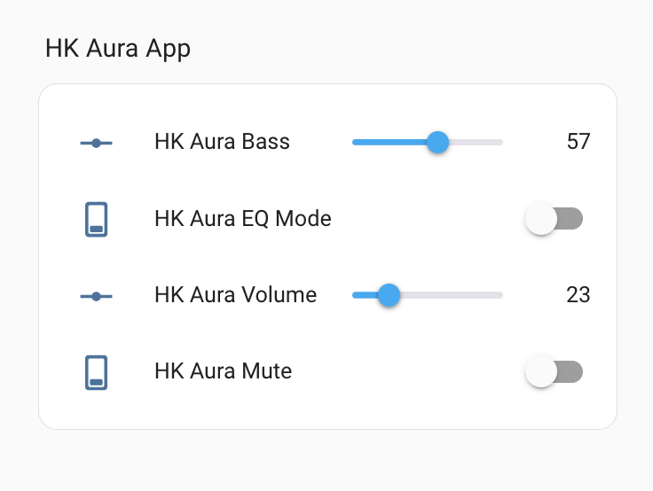

# HK Aura Plus Speaker Home Assistant Integration

This project is a custom Home Assistant integration for controlling the Harman Kardon Aura Plus speaker over your local network. It provides Home Assistant entities for volume, bass, EQ mode, and mute control, allowing you to automate and manage your speaker directly from Home Assistant.

## Features

- Control speaker volume
- Adjust bass level
- Change EQ modes
- Mute/unmute the speaker
- Seamless integration with Home Assistant UI and automations

## Requirements

- Home Assistant (2022.0 or newer recommended)
- Harman Kardon Aura Plus speaker connected to your local network

## Installation

1. **Download the integration:**
    - Clone or download this repository.

2. **Copy files:**
    - Copy the `hkaura_plus` directory to your Home Assistant `custom_components` folder.

3. **Restart Home Assistant:**
    - Restart Home Assistant to detect the new integration.

## Configuration

Add the following to your `configuration.yaml`:

```yaml
hkaura_plus:
  ip_address: 192.168.1.100  # Replace with your speaker's IP
  port: 10025
  name: Living Room Speaker
```

### Configuration Options

| Option | Required | Description |
|--------|----------|-------------|
| `host` | Yes      | IP address of your HK Aura Plus speaker |
| `name` | No       | Friendly name for the speaker entity    |

## Usage

After configuration and restart, you will see new entities in Home Assistant for your HK Aura Plus speaker. You can control volume, bass, EQ, and mute from the UI or use them in automations.

## Dashboard 



```yaml
type: grid
cards:
  - type: heading
    heading_style: title
    heading: HK Aura App
  - type: entities
    entities:
      - entity: number.hk_aura_bass_level
      - entity: switch.hk_aura_eq_mode
      - entity: number.hk_aura_volume
      - entity: switch.hk_aura_mute
```

## Troubleshooting

- Ensure your speaker is on the same network as Home Assistant.
- Check the IP address in your configuration.
- Review Home Assistant logs for integration errors.

## Disclaimer

This integration is not affiliated with or endorsed by Harman Kardon.

