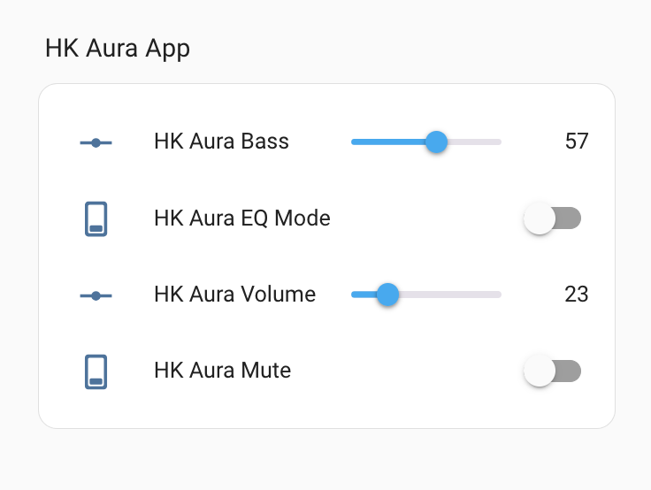

# HK Aura Plus Speaker Home Assistant Integration

A custom Home Assistant integration for controlling the Harman Kardon Aura Plus speaker over your local network. Provides Home Assistant entities for volume, bass, EQ mode, mute, and power control.

## Features

- **Volume Control** — Adjust speaker volume (0–100)
- **Bass Control** — Fine-tune bass level (0–100)
- **EQ Mode** — Toggle between Basic and Stereo Widening
- **Mute/Unmute** — Toggle switch
- **Power Off** — Turn off speaker via button
- **Volume Sync** — Optionally sync with a media_player entity
- Seamless integration with Home Assistant UI and automations

> **⚠️ Note**: The power-off button fully shuts down the speaker. To turn it back on, you must use the physical power button, the official HK Remote app, or a [Bluetooth wake script](#bluetooth-wake-from-standby).

## Requirements

- Home Assistant (2022.0 or newer recommended)
- Harman Kardon Aura Plus speaker connected to your local network

## Installation

1. **Clone or download** this repository.
2. **Copy** the `hkaura_plus/` directory to your Home Assistant `custom_components/` folder.
3. **Restart** Home Assistant to detect the new integration.

## Configuration

Add the following to your `configuration.yaml` (see [example](docs/configuration.yaml.example)):

```yaml
hkaura_plus:
  ip_address: 192.168.1.100  # Replace with your speaker's IP
  port: 10025  # Default port for HK Aura Plus
  device_name: "Living Room Speaker"  # Optional: friendly name
  media_player_entity: "media_player.spotify"  # Optional: enables volume sync
```

### Configuration Options

| Option | Required | Description |
|--------|----------|-------------|
| `ip_address` | Yes | IP address of your HK Aura Plus speaker |
| `port` | Yes | Port number for communication (default: 10025) |
| `device_name` | No | Friendly name for the speaker entity |
| `media_player_entity` | No | Entity ID of a media player to sync volume with |

### Volume Sync

If you configure `media_player_entity`, the volume slider will automatically update when volume is changed through the specified media player (e.g., Music Assistant). This keeps the UI in sync regardless of how you control the volume.

## Usage

After configuration and restart, the following entities appear in Home Assistant:

| Entity | Description |
|--------|-------------|
| `number.hk_aura_volume` | Volume control (0–100) |
| `number.hk_aura_bass` | Bass level (0–100) |
| `switch.hk_aura_eq_mode` | EQ mode toggle |
| `switch.hk_aura_mute` | Mute toggle |
| `button.hk_aura_power_off` | Power off button |

## Dashboard



<details>
<summary>Lovelace YAML</summary>

```yaml
type: grid
cards:
  - type: heading
    heading_style: title
    heading: HK Aura App
  - type: entities
    entities:
      - entity: number.hk_aura_volume
      - entity: number.hk_aura_bass
      - entity: switch.hk_aura_eq_mode
      - entity: switch.hk_aura_mute
      - entity: button.hk_aura_power_off
```

</details>

## Bluetooth Wake from Standby

The speaker's WiFi control port (TCP 10025) only opens after it receives a Bluetooth A2DP audio stream. Scripts are provided to automate this:

| Script | Platform | Description |
|--------|----------|-------------|
| [`scripts/wake_speaker_mac.sh`](scripts/wake_speaker_mac.sh) | macOS | Uses blueutil + mpv |
| [`scripts/wake_speaker_linux.sh`](scripts/wake_speaker_linux.sh) | Linux / Raspberry Pi | Uses bluetoothctl + PipeWire + mpv |
| [`scripts/setup_wake_speaker.sh`](scripts/setup_wake_speaker.sh) | Linux | Interactive setup wizard |


## Project Structure

```
├── hkaura_plus/          # Home Assistant custom component
├── scripts/              # Wake scripts & test utilities
└── img/                  # Screenshots
```

## Troubleshooting

- Ensure your speaker is on the same network as Home Assistant.
- Check the IP address in your configuration.
- Review Home Assistant logs for integration errors.

## Disclaimer

This integration is not affiliated with or endorsed by Harman Kardon.

## License

MIT — see [LICENSE](LICENSE) for details.